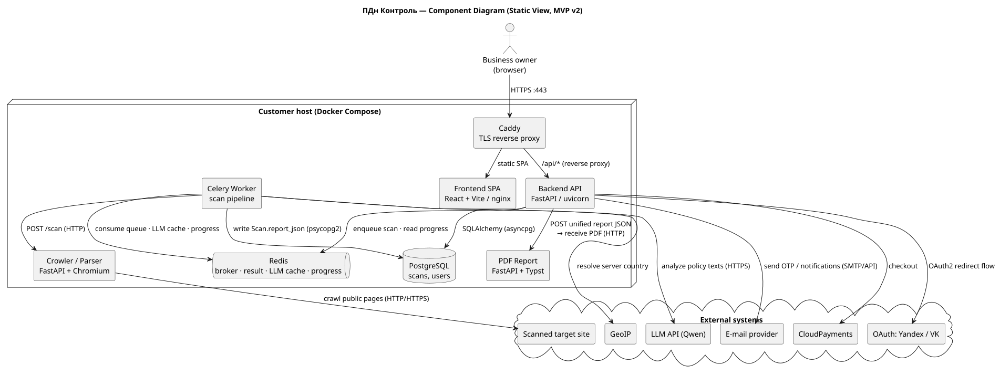
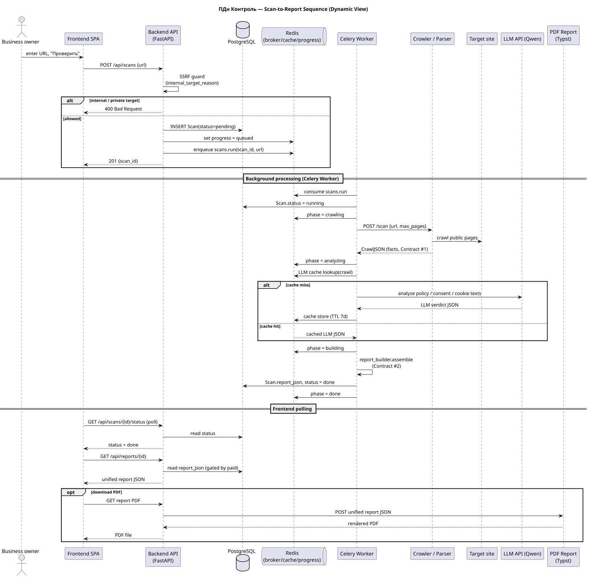
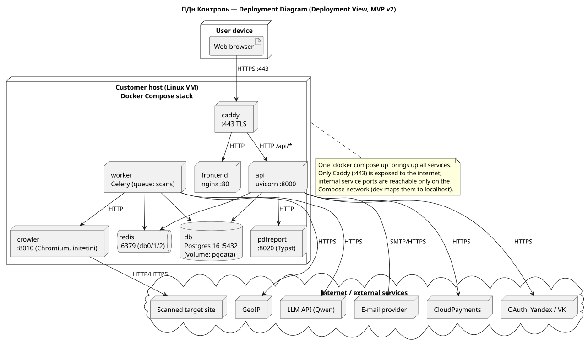

# Architecture — ПДн Контроль

This document is the maintained architecture reference for the product. It describes the system
from three reasoning angles — a **static view** (what the system is made of), a **dynamic view**
(how the core flow works), and a **deployment view** (how it runs and is operated) — and links
the [Architecture Decision Records](#architecture-decision-records-adrs) that explain why the
important decisions were made.

All diagrams are **diagrams-as-code** (PlantUML). The editable sources live next to the rendered
SVGs in the repository, so the diagrams are versioned with the product and reviewed through the
normal PR workflow.

| View | Source | Rendered |
|---|---|---|
| Static (component) | [`static-view/component-diagram.puml`](static-view/component-diagram.puml) | [SVG](static-view/component-diagram.svg) |
| Dynamic (sequence) | [`dynamic-view/scan-sequence.puml`](dynamic-view/scan-sequence.puml) | [SVG](dynamic-view/scan-sequence.svg) |
| Deployment | [`deployment-view/deployment-diagram.puml`](deployment-view/deployment-diagram.puml) | [SVG](deployment-view/deployment-diagram.svg) |

> **Rendering:** `java -jar plantuml.jar -tsvg docs/architecture/**/*.puml`. The component and
> deployment diagrams use PlantUML's built-in **Smetana** layout engine (`!pragma layout smetana`)
> so they render without a local Graphviz/`dot` install.

---

## Static View — Component Diagram

### What the diagram shows

The product is a small set of cooperating services that run together as one Docker Compose stack
on the customer's host, plus the external systems they talk to:

- **Caddy** — TLS reverse proxy; the only internet-facing entry point (`:443`). Routes static
  requests to the frontend and `/api/*` to the backend.
- **Frontend SPA** (React + Vite, served by nginx) — the user-facing UI.
- **Backend API** (FastAPI/uvicorn) — request handling: `auth`, `scans`, `reports`, `billing`,
  `health`. It validates scan requests (anti-SSRF), persists state, enqueues background work, and
  serves the unified report.
- **Celery Worker** — runs the scan pipeline asynchronously: crawl → LLM analysis → report
  assembly. Decoupled from the API so a slow crawl/LLM call never blocks an HTTP request.
- **Crowler / Parser** (FastAPI + Chromium) — crawls the target site's public pages and returns
  **facts** (Contract #1), not verdicts.
- **PDF Report** (FastAPI + Typst) — renders the unified report JSON (Contract #2) into a PDF.
- **PostgreSQL** — durable state (scans, users, stored report JSON).
- **Redis** — Celery broker/result backend, the LLM response cache, and live scan-progress.
- **External systems** — the scanned target site, the LLM API (Qwen), GeoIP, OAuth providers
  (Yandex/VK — new in MVP v2), the e-mail provider (new in MVP v2), and CloudPayments.

### Coupling and cohesion

- **High cohesion per service.** Each component owns one responsibility: the crawler only
  produces facts, the LLM analyzer only reasons over policy text, `report_builder` only assembles
  Contract #2, the PDF service only renders. The backend is further split by routers and a
  `services/` layer (`ssrf`, `crawler_client`, `llm_analyzer`, `report_builder`, `pdf_client`,
  `auth`, `scan_progress`), so each concern is testable in isolation.
- **Loose runtime coupling through stable contracts.** Components integrate over HTTP/JSON
  contracts (Contract #1 parser→backend, Contract #2 backend→PDF/frontend) and over Redis, not
  through shared code. The crawler and PDF service have no knowledge of the backend's internals;
  they can be replaced as long as the JSON contract holds.
- **Asynchrony as a decoupler.** The API ↔ Worker boundary is a Redis queue, so the slow,
  failure-prone path (network crawl + LLM) is isolated from the synchronous request path.
- **Remaining coupling to watch.** The worker depends on three external services (crawler, LLM,
  GeoIP); any of them failing fails the scan (by design — no rule-engine fallback). The two JSON
  contracts are the most important coupling points and must be changed in lockstep on both sides.

### Maintainability implications

The contract-based, single-responsibility split keeps the codebase **modifiable**: the MVP v2
auth work (OAuth, OTP, e-mail) is confined to the `auth` router/service and does not touch the
scan pipeline; the cookie-`target_role` feedback fix is a localized change in the violation
catalog. The clear service seams make the system **testable** (each service has its own suite in
CI). The main maintainability cost is operational: more moving parts to run and the two contracts
to keep synchronized.

### Quality requirements supported or constrained

- **[QR-01 — Crawler confidentiality / anti-SSRF](../quality-requirements.md#qr-01--crawler-confidentiality-against-ssrf)** is supported structurally: all scan requests pass through the API's `ssrf` guard before any crawl is enqueued (see [ADR-0003](adr/0003-server-side-gating-and-ssrf-boundary.md)).
- **[QR-02 — Deterministic scan results](../quality-requirements.md#qr-02--deterministic-scan-results)** is supported by the Redis LLM cache + canonicalized crawl input and by using **GeoIP** instead of the LLM for hosting/IP facts (see [ADR-0002](adr/0002-deterministic-geoip-over-llm.md)).
- **[QR-03 — Correct fact-to-violation mapping](../quality-requirements.md#qr-03--correct-fact-to-violation-mapping-rule-engine)** is now carried by the LLM analyzer + `report_builder` rather than a rule-engine (see [ADR-0001](adr/0001-full-llm-analysis-pipeline.md)); the structure concentrates correctness risk in one analyzed boundary that the QRTs target.

---

## Dynamic View — Scan-to-Report Sequence

### What the diagram shows

The full lifecycle of the product's central use case: a user submits a URL and eventually gets a
report. The API performs an **SSRF check**, persists a `pending` scan, and enqueues the job; the
**Celery worker** then drives crawl → (cached) LLM analysis → report assembly, updating a Redis
progress phase at each step; the frontend **polls** status until `done` and fetches the unified
report; optionally the report is rendered to PDF.

### Why this scenario matters

This is the product's core value path — everything else (auth, billing, history) exists to
support it. It is also the most architecturally interesting flow: it crosses every component,
mixes synchronous (HTTP request/response) and asynchronous (queue + polling) styles, and depends
on two slow, unreliable external calls (crawl, LLM).

### What it lets the reader reason about

- **The async boundary (ADR-rooted):** the API returns `201` immediately and the worker does the
  heavy lifting — explaining why there is a queue, a progress channel, and frontend polling
  instead of one long request.
- **Integration boundaries:** the crawler call (Contract #1) and the PDF call (Contract #2) are
  explicit HTTP hops; the LLM call sits behind a **cache** that directly implements determinism
  ([QR-02](../quality-requirements.md#qr-02--deterministic-scan-results)).
- **Quality requirements in action:** the very first interaction is the anti-SSRF gate
  ([QR-01](../quality-requirements.md#qr-01--crawler-confidentiality-against-ssrf)), and the
  report read is **gated by payment** server-side ([ADR-0003](adr/0003-server-side-gating-and-ssrf-boundary.md)),
  not by the frontend blur.
- **Failure handling:** any failure in crawl/LLM/assembly marks the scan `failed` with no
  fallback — a deliberate decision recorded in [ADR-0001](adr/0001-full-llm-analysis-pipeline.md).

---

## Deployment View — Runtime Topology

### What the diagram shows

The runtime/deployment structure: the user's browser, the **customer host** running the whole
stack as Docker Compose services (`caddy`, `frontend`, `api`, `worker`, `crowler`, `pdfreport`,
`db`, `redis` with the `pgdata` volume), and the external services reached over the internet.
Only **Caddy (`:443`)** is exposed publicly; the other ports are internal to the Compose network
(in dev they are mapped to `localhost` for convenience).

### Why this deployment model was chosen

- **Single-host Docker Compose** keeps the operational surface small enough for an SMB customer to
  run on one VM with `docker compose up`, which is exactly what the customer asked for (host on
  their own infrastructure and redirect DNS). See [ADR-0004](adr/0004-single-host-compose-caddy-tls.md).
- **Caddy in front** gives automatic TLS (Let's Encrypt) and a single hardened entry point,
  satisfying the "internet-accessible, TLS-secured" requirement without hand-managing certs.

### How it supports or constrains the product

- **Supports:** simple reproducible deploys, one network boundary to reason about for security,
  and a clean place (Caddy) to terminate TLS and route. The worker scales by `--concurrency`.
- **Constrains:** it is a **single-node** topology — no horizontal scaling or HA. Postgres and
  Redis are single instances; the `pgdata` volume is the durability boundary that must be backed
  up. Heavy concurrent scans are bounded by `MAX_CONCURRENT_SCANS` (crawler) and worker
  concurrency.

### What to consider when deploying / operating it

- Secrets (`JWT_SECRET`, `LLM_API_KEY`, `CLOUDPAYMENTS_*`, OAuth/e-mail credentials) go in
  `backend/.env.secret` (never committed); infrastructure URLs are set in Compose. See
  [`../development-process.md`](../development-process.md#configuration-management).
- The crawler runs Chromium and needs `init: true` (tini) to reap zombie processes and a larger
  `shm_size`.
- Operating the customer-facing path means keeping Caddy's TLS valid and ensuring the external
  dependencies (LLM, GeoIP, OAuth, e-mail) are reachable; an outage of any of them degrades scans.

---

## Architecture Decision Records (ADRs)

The decisions behind this architecture are recorded as ADRs in [`adr/`](adr/). Each ADR names the
quality requirement(s) it addresses; `docs/quality-requirements.md` links back to them.

| ADR | Decision | Quality requirement(s) |
|---|---|---|
| [ADR-0001](adr/0001-full-llm-analysis-pipeline.md) | Full-LLM analysis pipeline (no rule-engine fallback) | QR-03 |
| [ADR-0002](adr/0002-deterministic-geoip-over-llm.md) | Deterministic GeoIP for hosting/IP facts instead of LLM | QR-02 |
| [ADR-0003](adr/0003-server-side-gating-and-ssrf-boundary.md) | Server-side report gating + anti-SSRF boundary in the API | QR-01 |
| [ADR-0004](adr/0004-single-host-compose-caddy-tls.md) | Single-host Docker Compose behind Caddy/TLS | QR-01, QR-02 |

**How they fit together:** the static view shows *where* these decisions live (the API SSRF
guard, the worker's LLM/GeoIP calls, the Compose/Caddy boundary), the dynamic view shows *when*
they take effect during a scan (SSRF gate first, cached LLM call, payment-gated report read), and
the deployment view shows *how* they are operated (one TLS-terminated host). Together they keep
the product's three quality requirements — confidentiality, determinism, and correct
fact-to-violation mapping — traceable from a documented decision to a place in the running system.
