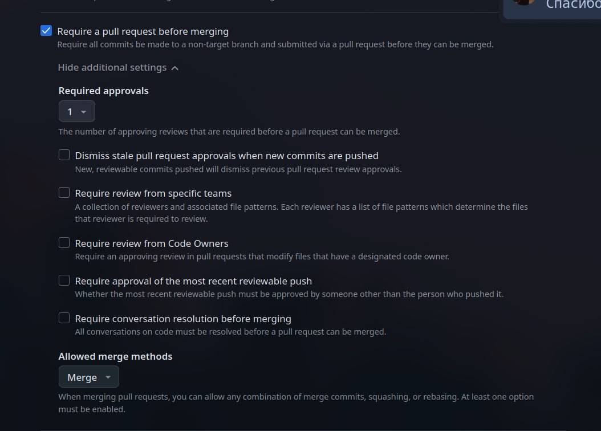
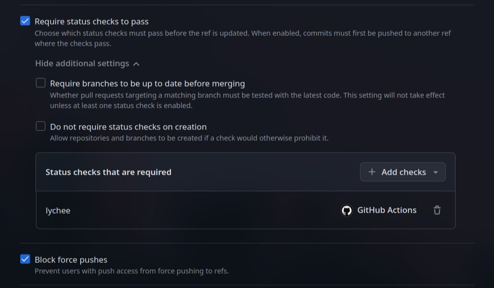
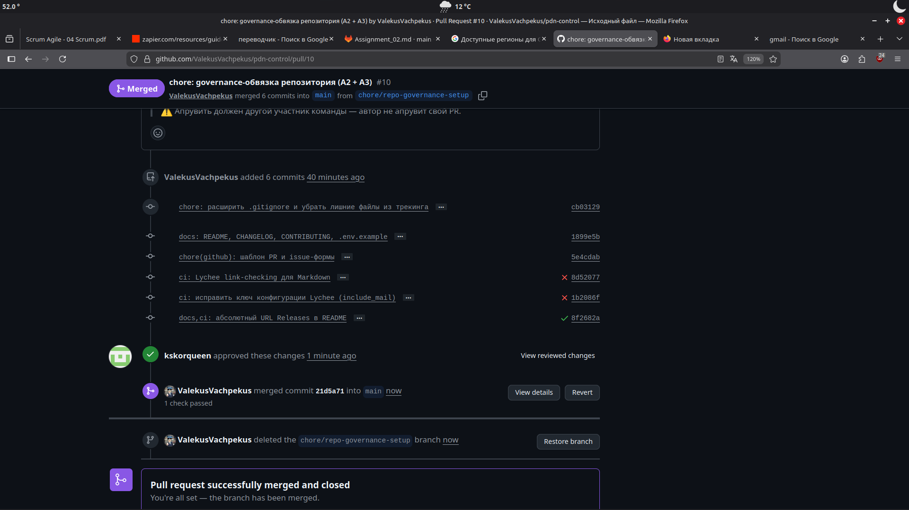
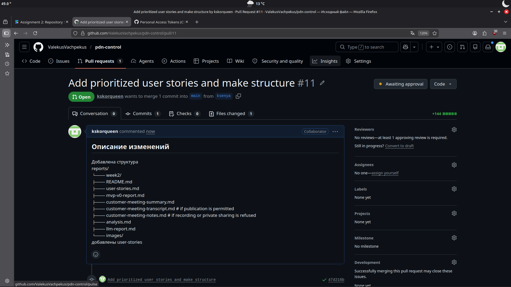
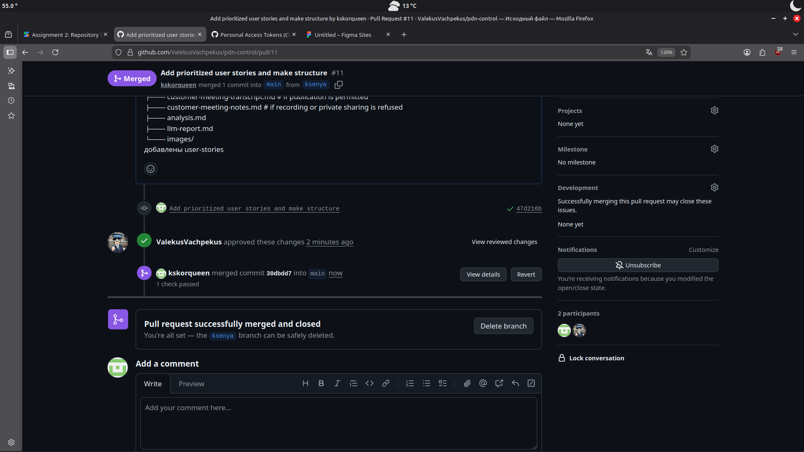
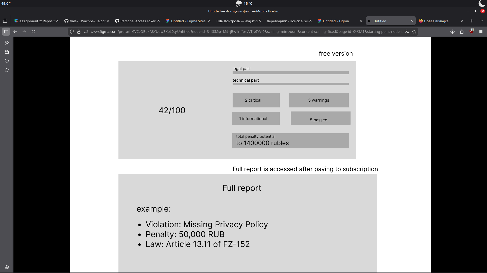
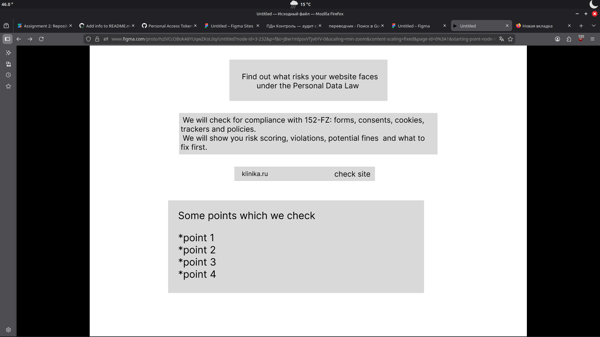
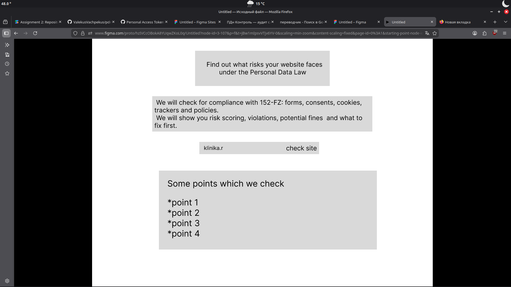
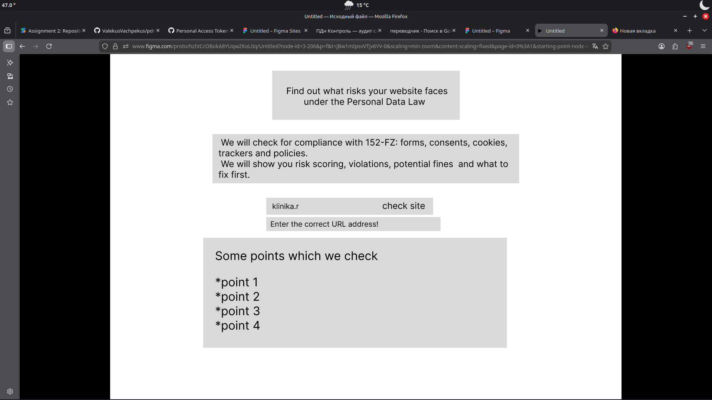
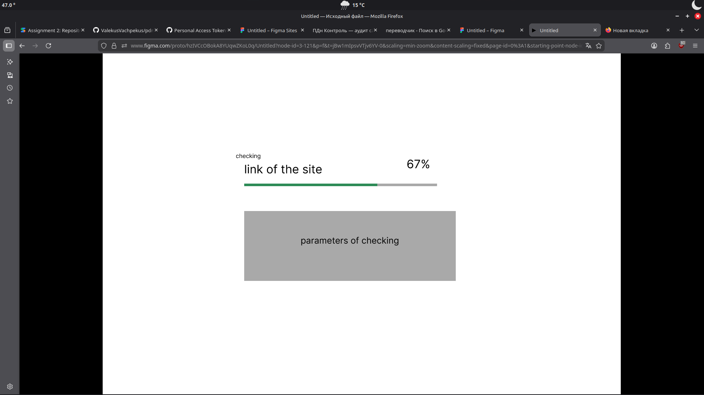

# Assignment 2 — Week 2 Report — ПДн Контроль

**ПДн Контроль** is a web service for preliminary **technical** audits of small and
medium business websites against typical **152-FZ** ("On Personal Data") compliance
risks. It is an MVP and a risk-reduction tool, **not** a legal guarantee.

License: [MIT](../../LICENSE).

> This file is an **index** for the Assignment 2 submission. Substantive content lives
> in the dedicated files linked below.

---

## 1. User stories

- [user-stories.md](user-stories.md) — 11 user stories (US-01 … US-11) with stable IDs,
  MoSCoW priorities, requirement status, and the **Initial proposed MVP v1 scope**
  (US-01 – US-05).

## 2. Prototype and interface artifacts

## Prototype Coverage
The interactive Figma prototype demonstrates the user flow for the following core MVP v1 user stories:
*   **US-01 (Basic website scan):** The Home screen allows users to input a URL.
*   **US-02 & US-03 & US-04 (Fine display, Violations, Legal refs):** The Report screen displays the total fine, a detailed list of violations, and references to FZ-152 articles.
*   **US-05 (Free tier limited check):** The flow includes a restriction that requires upgrading for full details.
*   **Error State:** Demonstrates the system's reaction to an invalid URL.

[Link to interactive Figma prototype](https://www.figma.com/proto/hzIVCcOBokA8YUqwZKoL0q/Untitled?node-id=3-107&p=f&t=1HviSoUJakE6VTAo-1&scaling=min-zoom&content-scaling=fixed&page-id=0%3A1&starting-point-node-id=3%3A107)

## 3. MVP v0

- [mvp-v0-report.md](mvp-v0-report.md) — purpose, deployment, video demo, limitations,
  local setup link, and the repeatable smoke-check scenario.
- **Deployment / runnable artifact:** http://10.93.26.163:8080/ — hosted on the university VM, accessible from the Innopolis University network (where the TA can reach it). See [mvp-v0-report.md](mvp-v0-report.md) for access instructions.
- **Run instructions:** root [README.md → "Локальный запуск"](../../README.md#локальный-запуск).
- **Public video demonstration (< 2 min):** <!-- TODO: paste the public sanitized video link --> _to be published (see mvp-v0-report.md)_.

## 4. PR/MR workflow

- **PR template:** [.github/pull_request_template.md](../../.github/pull_request_template.md).
- **Reviewed PRs (reviewed by another team member, not self-review):**
  - [PR #19](https://github.com/ValekusVachpekus/pdn-control/pull/19) — frontend bug fixes (page reload, loading screen).
  - [PR #20](https://github.com/ValekusVachpekus/pdn-control/pull/20) — `llm_analyzer.py` update.
  - [PR #21](https://github.com/ValekusVachpekus/pdn-control/pull/21) — `.env.example` update.
  - [PR #23](https://github.com/ValekusVachpekus/pdn-control/pull/23) — realtime progress and deterministic scoring (open).

## 5. Link checking (Lychee)

- **Configuration:** [lychee.toml](../../lychee.toml).
- **Workflow:** [.github/workflows/lychee.yml](../../.github/workflows/lychee.yml).
- **Latest successful run on the protected default branch (`main`):**
  [run #27308571631](https://github.com/ValekusVachpekus/pdn-control/actions/runs/27308571631).

### Excluded Lychee links (justification + manual verification)

The following patterns are excluded in [lychee.toml](../../lychee.toml). Each was visited
manually in a browser before submission to confirm accessibility where applicable:

| Excluded pattern | Reason | Manual check |
|---|---|---|
| `^https?://localhost`, `^https?://127\.0\.0\.1` | Local dev-server addresses from run instructions; do not exist in CI. | N/A — local only |
| `^https?://(host\|backend):\d+` | Docker-internal service hostnames; resolvable only inside Compose. | N/A — internal only |
| `^https?://10\.93\.26\.163` | MVP v0 deployment on the university VM; private IP reachable only from the Innopolis network, unreachable from CI. | Verified accessible from the university network |
| `^https://gitlab\.pg\.innopolis\.university` | Behind corporate auth; not reachable anonymously from CI. | Verified accessible when authenticated |

## 6. Screenshots

**Protected default branch settings**

**Example reviewed PR (review by another team member)**

**Selected prototype and interface artifacts**

**Deployed MVP v0 or runnable artifact**

<!-- TODO: add a PNG screenshot of the deployed/running MVP v0 (at http://10.93.26.163:8080/) into images/ and embed it here -->
_To be added — see [mvp-v0-report.md](mvp-v0-report.md)._

## 7. Customer review

- **Meeting summary:** [customer-meeting-summary.md](customer-meeting-summary.md).
- **Sanitized English transcript (published with the customer's permission):**
  [customer-meeting-transcript.md](customer-meeting-transcript.md).
- Recording and private instructor sharing were **granted**; the customer also permitted
  **publishing** the sanitized transcript in this repository. Detailed notes
  (`customer-meeting-notes.md`) are therefore **not** used as evidence for this submission.

## 8. Analysis and LLM usage

- **Week 2 analysis:** [analysis.md](analysis.md).
- **LLM usage report:** [llm-report.md](llm-report.md).

---

