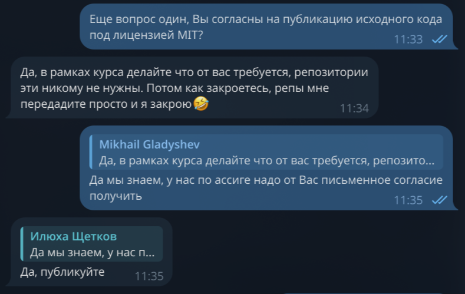

# Customer Meeting Summary — Week 2 (ПДн-Контроль)

**Date:** 2026-06-12
**Format:** online call (Yandex Telemost)
**Duration:** ~18 min

## Participants
| Role          | Pseudonym / GitHub username        |
| ------------- | ---------------------------------- |
| Customer      | customer                           |
| Product Owner | ValekusVachpekus                   |
| Scrum Master  | kskorqueen                         |
| Developer(s)  | alexzhal1, azenlrd, ShakhraiMaksim |

> Real names are not used — only pseudonyms / usernames.

## Procedural decisions
- **Consent to MIT / public development model:** Yes (written consent obtained before the repository was created). 
- **Recording permission:** granted.
- **Private sharing of recording and transcript with instructors:** granted.
- **Publishing the sanitized transcript in the repository (one-time decision):** granted.

## Artifacts demonstrated
- `reports/week2/user-stories.md` (US-01 … US-11)
- Initial proposed MVP v1 scope: US-01, US-02, US-03, US-04, US-05
- Figma prototype: https://www.figma.com/proto/hzIVCcOBokA8YUqwZKoL0q/Untitled?node-id=3-107&p=f&t=1HviSoUJakE6VTAo-1&scaling=min-zoom&content-scaling=fixed&page-id=0%3A1&starting-point-node-id=3%3A107
- MVP v0: http://10.93.26.163:8080/

## Discussion points
- **User stories (US-01 … US-11):** presented to the customer; the customer confirmed the set is sufficient.
- **Figma prototype:** shown/described; the customer asked for the link in a direct message and noted he had already seen the design last Monday — he is satisfied with it.
- **MoSCoW priorities:** approved overall. The customer asked to raise the 0–100 risk score (US-07) to **equal priority** with the total fine (US-02) rather than keeping it secondary.
- **Initial MVP v1 scope (US-01–US-05):** approved.
- **Target audience:** confirmed that the primary persona is small and medium business owners.
- **Monetization (US-05 / US-06):** the free/paid model with one-time payment was confirmed. The free version shows only the **total fine and the number of violations**; the violation list itself is in the paid version. The customer agreed.
- **Payment provider (US-06):** **CloudPayments** was chosen; the payment system does not need to be implemented.
- **MVP v0 (demo):** shown to the customer via screen sharing. Feedback — make the total fine larger and higher-contrast. The customer asked for a link to test it himself and asked about the reliability of the check; the team reported bugs and that they are starting to fix them.
- **Deployment / accessibility:** the product is deployed on a university VM and is not accessible outside the university network. The customer suggested contacting `[Name of customer]` for a VPS.
- **Email registration / SMTP:** SMTP requires a domain; the customer said to contact `[Name of customer]`, who will provide a domain.
- **Lawyer:** the customer's lawyer will review the website (a separate meeting with the lawyer is not needed — what is needed is the website review itself).
- **Legal texts:** the customer will provide the privacy policy text later.

## Customer approvals (mandatory)
| Subject of approval                                   | Status   | Comment |
| ----------------------------------------------------- | -------- | ------- |
| User stories (US-01 … US-11)                          | approved |         |
| MoSCoW priorities                                     | approved |         |
| Initial MVP v1 scope (US-01–US-05)                    | approved |         |
| Final approval of the updated version (after changes) | yes      |         |

## Prototype feedback
- Give the fine the same emphasis as the 0–100 score.

## Decisions
- Give the fine the same emphasis as the 0–100 score.
- Request a domain for registration.

## Action points
| #   | Action                                                                                  | Owner              | Related US / artifact |
| --- | --------------------------------------------------------------------------------------- | ------------------ | --------------------- |
| 1   | Strengthen the visual emphasis of the fine on the result screen (larger, higher contrast) | alexzhal1          | US-02 / MVP v0        |
| 2   | Raise US-07 (0–100 risk) to equal priority with US-02 in `user-stories.md` and MoSCoW   | ValekusVachpekus   | US-07, US-02          |
| 3   | Update the free-version scope: show only the total fine and the number of violations    | ValekusVachpekus   | US-05, US-06          |
| 4   | Deploy MVP v0 and send the customer a link to test it himself                           | alexzhal1          | MVP v0                |
| 5   | Fix the parser / website-check bugs                                                      | alexzhal1, azenlrd | US-01 / MVP v0        |
| 6   | Resolve external access to the MVP (request a VPS from `[Name of customer]`)             | ValekusVachpekus   | MVP v0 / deployment   |
| 7   | Obtain a domain for SMTP / email registration (from `[Name of customer]`)                | ValekusVachpekus   | registration          |
| 8   | Obtain the privacy policy and terms-of-use texts from the customer                       | ValekusVachpekus   | legal documents       |

## Risks
- **MVP v0 is not accessible from the internet.** Deployed on a university VM (internal address `http://10.93.26.163:8080/`), reachable only from the Innopolis network. The customer cannot test it; per Assignment 2 (Part 4) a hosted product must be accessible from the internet until grading is complete. A VPS / external access is needed.
- **Email registration is blocked without a domain.** SMTP will not work until the customer provides a domain.
- **Reliability of the check.** There are parser bugs — some violations are not detected, which reduces trust in the result (total fine, number of violations).
- **Legal accuracy is unconfirmed.** The fine calculation (US-02) and the 152-FZ article references (US-04) have not yet been reviewed by the customer's lawyer — risk of incorrect legal conclusions.
- **Legal texts are placeholders.** The privacy policy and terms of use depend on the customer and have not been provided yet.

## Changes made as a result of the meeting
- **US-07 (0–100 risk score):** priority raised to equal with US-02 (total fine). On the result screen the score and the fine are shown side by side, both with strong emphasis. Reason — customer request.
- **US-05 / US-06 (free/paid):** the composition of the free version was fixed — only the total fine and the number of violations; the detailed violation list goes to the paid version.
- **US-06 (payment):** the payment provider was fixed — CloudPayments; a custom payment system does not need to be implemented.
- **US-02 (total fine):** strengthen the visual emphasis of the fine on the result screen (larger / higher contrast).
