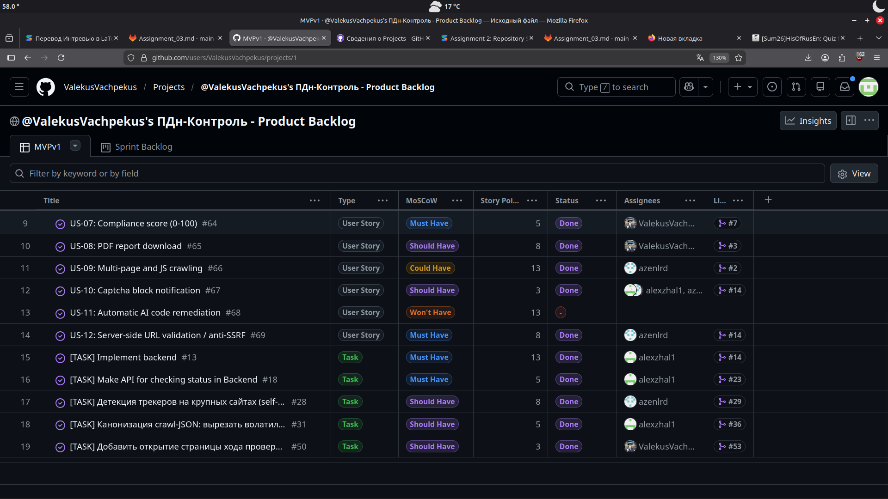
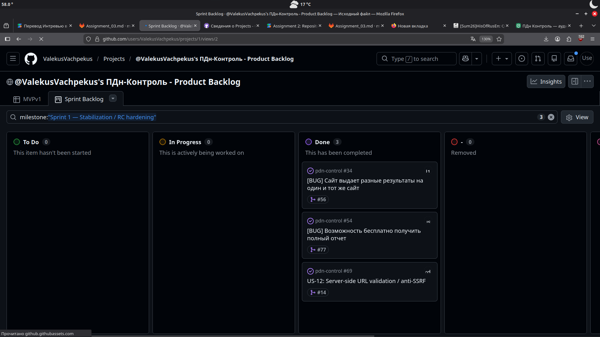
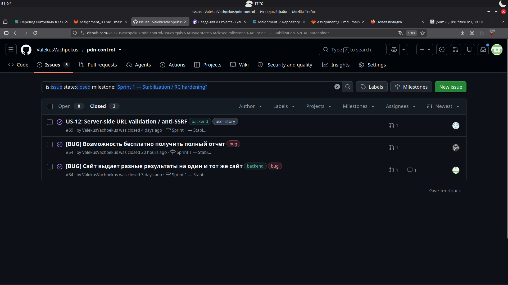
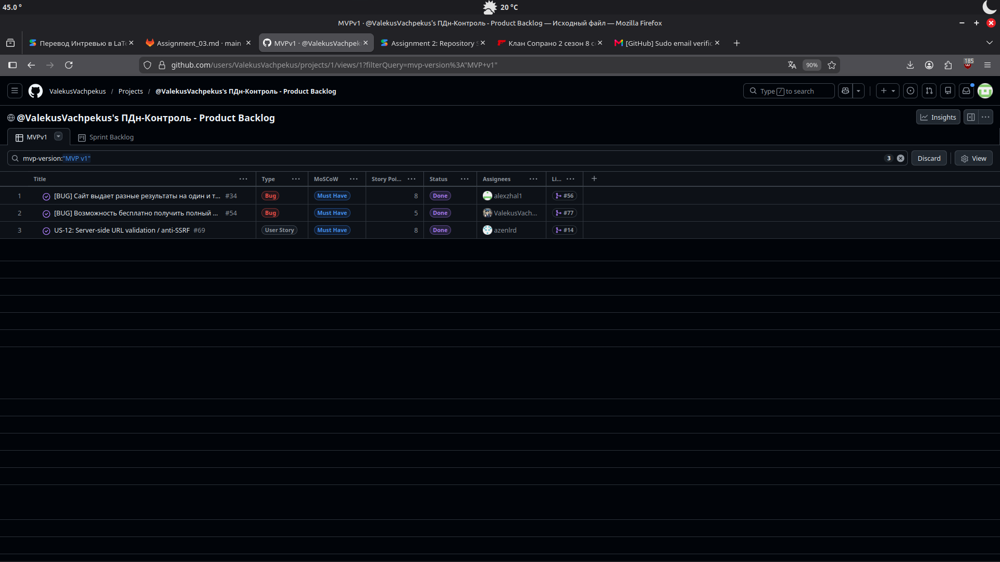
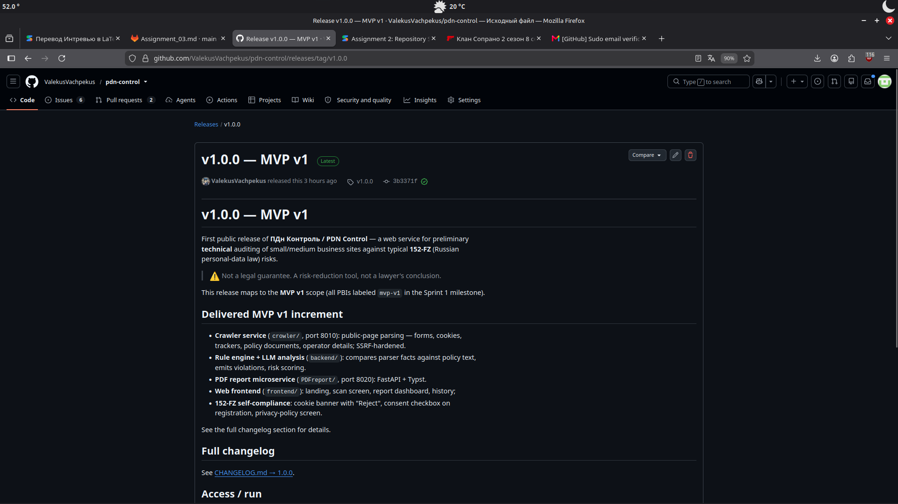
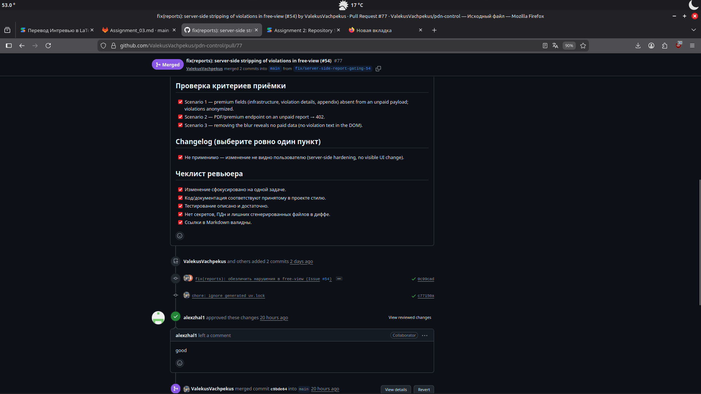
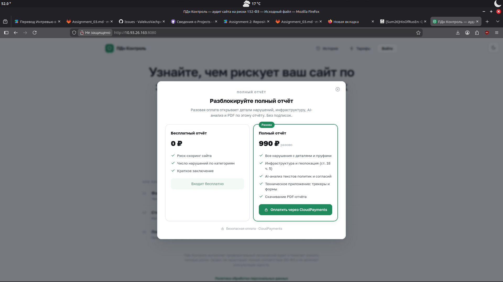

# Assignment 3 — ПДн Контроль (Week 3 Report)

**Project Description:** A specialized web service designed for preliminary technical audits of small and medium business websites to identify typical 152-FZ ("On Personal Data") compliance risks. It provides risk-scoring, violation lists, and legal remediation steps.

- **License:** [Root MIT LICENSE](https://github.com/ValekusVachpekus/pdn-control/blob/main/LICENSE)
- **Process Requirements:** [Process_Requirements.md](https://gitlab.pg.innopolis.university/search?search=re&nav_source=navbar&project_id=3315&group_id=5842&search_code=true&repository_ref=main)
- **Issue Template:** [Link to Issue Templates](https://github.com/ValekusVachpekus/pdn-control/blob/main/.github/pull_request_template.md)

Index for the Week 3 submission. These are **Course Task artifacts** (reporting/evidence); the live backlog is maintained in GitHub Issues and the Project Board.

## Backlog, Scope & Refinement
- [Historical User Stories (Week 2)](https://github.com/ValekusVachpekus/pdn-control/blob/main/reports/week2/user-stories.md)
- [Current User Story Index (Week 3)](https://github.com/ValekusVachpekus/pdn-control/blob/main/docs/user-stories.md)
- [Definition of Done](.https://github.com/ValekusVachpekus/pdn-control/blob/main/docs/definition-of-done.md)
- [Backlog Summary & Rationale](https://github.com/ValekusVachpekus/pdn-control/blob/main/reports/week3/backlog.md)

**Backlog Statistics:**
- **Total Product Backlog:** 116 Story Points (19 PBIs).
- **Current Sprint 1 Size:** 26 Story Points.
- **MVP v1 Scope:** 55 Story Points. 

**MVP v1 Scope Description:** 
The selected MVP v1 scope includes core URL scanning, server-side SSRF protection, deterministic results, and fine calculations. It covers the most critical "Must-Have" features required for a safe public launch.

**PBI & Process Explanation:** 
We use standard Scrum PBIs: User Stories for functionality, Bugs for stabilization, and Tasks for infrastructure. Statuses follow the flow: To Do → Ready → In Progress → Review → Done. MVP scope is tracked via the "MVP version" custom field and filtered views.

## Authoritative Live Sources
- **Sprint 1 Milestone:** [https://github.com/ValekusVachpekus/pdn-control/milestone/1](https://github.com/ValekusVachpekus/pdn-control/milestone/1)
- **Product Backlog Board:** [https://github.com/users/ValekusVachpekus/projects/1/views/1](https://github.com/users/ValekusVachpekus/projects/1/views/1)
- **Sprint Backlog Board:** [https://github.com/users/ValekusVachpekus/projects/1/views/2](https://github.com/users/ValekusVachpekus/projects/1/views/2)
- **MVP v1 Filtered View:** [Filtered Project Board View](https://github.com/users/ValekusVachpekus/projects/1/views/1?filterQuery=mvp-version%3A%22MVP+v1%22)

## Roadmap Summary
The [Roadmap](../../docs/roadmap.md) direction for the current Sprint was stabilization and core security (Anti-SSRF). For the next Sprint, the focus shifts to professional reporting (PDF export) and tracker detection logic to enhance audit depth.

## Artifacts, Evidence & Templates
- **MVP v1 Live Deployment:** [http://10.93.26.163:8080/](http://10.93.26.163:8080/) *(Note: Internal University IP, accessible via VPN only).*
- **Access & Run Instructions:** [Root README.md](https://github.com/ValekusVachpekus/pdn-control/blob/main/reports/week3/README.md)
- **Video Demo:** [https://drive.google.com/file/d/1702wC4z85jI1-pVNCTJYlckcvn1J3m_s/view?usp=sharing](https://drive.google.com/file/d/1702wC4z85jI1-pVNCTJYlckcvn1J3m_s/view?usp=sharing)
- **SemVer Release (MVP v1):** [v1.0.0 Release](https://github.com/ValekusVachpekus/pdn-control/releases/tag/v1.0.0)
- **Extended PR Template:** [pull_request_template.md](https://github.com/ValekusVachpekus/pdn-control/blob/main/.github/pull_request_template.md)
- **Reviewed PR Example:** [Reviewed PR #82](https://github.com/ValekusVachpekus/pdn-control/pull/82)
- **Verification Evidence:** All completed MVP v1 PBIs have verified acceptance criteria documented in [Closed Issues](https://github.com/ValekusVachpekus/pdn-control/issues?q=is%3Aissue+is%3Aclosed).

## Customer Feedback & Status
- **Feedback Integration:** Based on Assignment 2 feedback, we increased the UI contrast of the "Total Fine" display and implemented strict server-side URL validation.
- **Current Status:** MVP v1 core features are fully implemented and merged into the protected `main` branch.
- **Next Steps:** Implement US-08 (PDF Export) and Task #28 (Tracker detection).

## Weekly Reports
- [Customer Review Summary](customer-review-summary.md)
- [Customer Review Transcript](customer-review-transcript.md)
- [Reflection](reflection.md)
- [Retrospective](retrospective.md)
- [LLM Usage Report](llm-report.md)
- [CHANGELOG.md](../../CHANGELOG.md)

## Contribution Traceability
| Member | Issues Assigned | PRs/MRs Created | Review Activity |
|---|---|---|---|
| Ksenya Koroleva | | [PR #...]() | Approved #82 |
| Aleksandr Martiushev | #56| [PR #56]| Approved # |
| Airat Mingazov | #29, #57 | [PR #29,57] | Approved #74, #77|
| Ilia Shchetkov | #74, #77, #82 | [PR #74,77,82]| Approved #56, #57,#29 |
| Maksim Shakhrai |- | [-](-) | -|

## Screenshots

