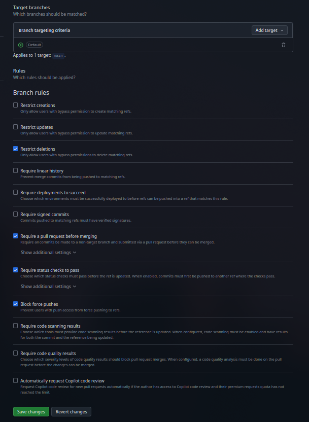
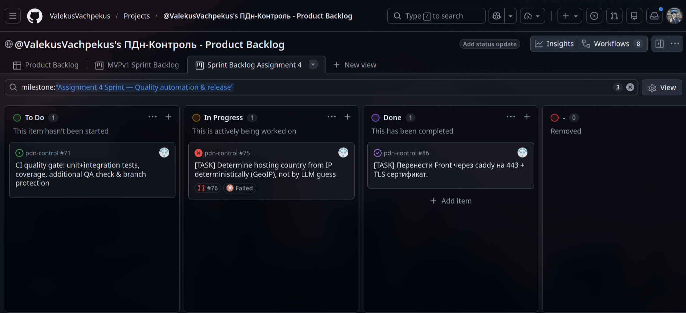
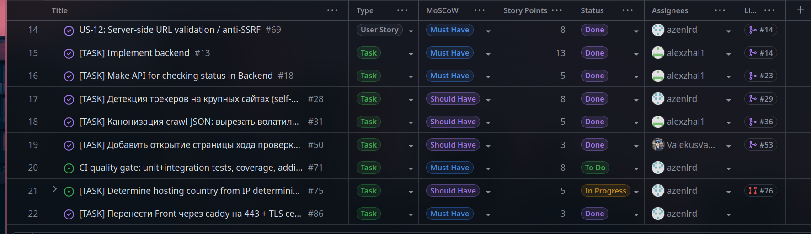
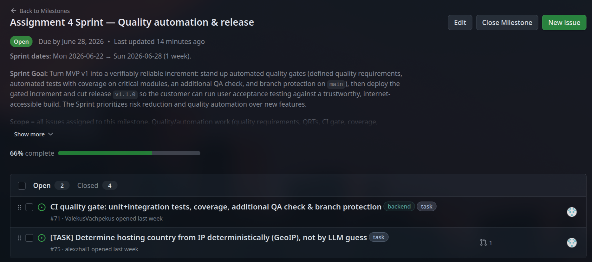
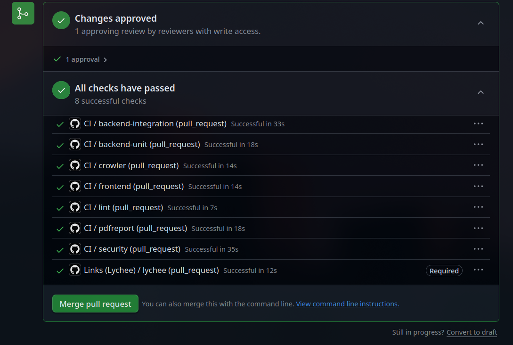
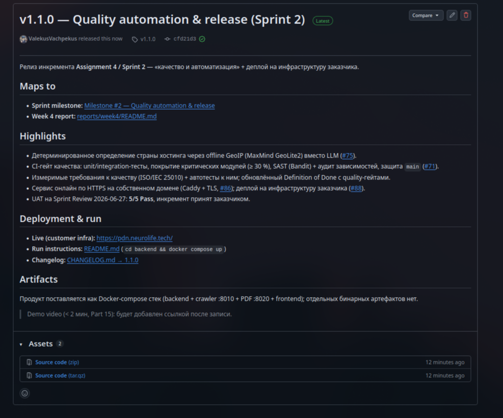

# Assignment 4 — ПДн Контроль (Week 4 Report)

**Project Description:** A specialized web service for preliminary **technical** audits of
small and medium business websites against typical **152-ФЗ** ("On Personal Data")
compliance risks. It provides risk-scoring, violation lists, potential fines, and legal
remediation steps. This week focused on **quality automation & release**: explicit quality
requirements, automated quality-requirement tests, CI quality gates, an updated Definition of
Done, user acceptance testing, and the v1.1.0 release.

- **License:** [Root MIT LICENSE](https://github.com/ValekusVachpekus/pdn-control/blob/main/LICENSE)
- **Process Requirements:** [Process_Requirements.md](https://gitlab.pg.innopolis.university/search?search=re&nav_source=navbar&project_id=3315&group_id=5842&search_code=true&repository_ref=main)
- **Issue Templates:** [.github/ISSUE_TEMPLATE](https://github.com/ValekusVachpekus/pdn-control/tree/main/.github/ISSUE_TEMPLATE)
- **Extended PR Template:** [pull_request_template.md](https://github.com/ValekusVachpekus/pdn-control/blob/main/.github/pull_request_template.md)

Index for the Week 4 submission. These are **Course Task artifacts** (reporting/evidence);
the live backlog is maintained in GitHub Issues and the Project Board.

## Sprint Planning (Part 1)

- **Roadmap (Sprint-by-Sprint plan):** [docs/roadmap.md](https://github.com/ValekusVachpekus/pdn-control/blob/main/docs/roadmap.md)
- **Sprint Milestone (Assignment 4):** [Milestone #2 — Quality automation & release](https://github.com/ValekusVachpekus/pdn-control/milestone/2) (due 2026-06-28)
- **Product Backlog Board:** [Project #1](https://github.com/users/ValekusVachpekus/projects/1)
- **Sprint Backlog (Assignment 4, filtered by milestone):** [Project board view](https://github.com/users/ValekusVachpekus/projects/1)
- **Planning PR:** [#87 — sprint planning](https://github.com/ValekusVachpekus/pdn-control/pull/87)

**Sprint Goal:** quality + deploy/release. Technical PBIs in the Sprint:

| PBI | Title | SP | Status |
|---|---|---|---|
| [#71](https://github.com/ValekusVachpekus/pdn-control/issues/71) | CI quality gate: tests, coverage, QA check & branch protection | 8 | Done ([#95](https://github.com/ValekusVachpekus/pdn-control/pull/95)) |
| [#75](https://github.com/ValekusVachpekus/pdn-control/issues/75) | Deterministic GeoIP hosting detection | 5 | Done ([#95](https://github.com/ValekusVachpekus/pdn-control/pull/95)) |
| [#86](https://github.com/ValekusVachpekus/pdn-control/issues/86) | Front via Caddy on 443 + TLS | 3 | Done |
| [#88](https://github.com/ValekusVachpekus/pdn-control/issues/88) | Deploy to customer infra + DNS migration | 5 | Done |

## Quality Requirements & Tests (Parts 3–4)

- **Quality Requirements (ISO/IEC 25010):** [docs/quality-requirements.md](https://github.com/ValekusVachpekus/pdn-control/blob/main/docs/quality-requirements.md)
- **Quality Requirement Tests (QR ↔ test mapping):** [docs/quality-requirement-tests.md](https://github.com/ValekusVachpekus/pdn-control/blob/main/docs/quality-requirement-tests.md)
- **QR/QRT PR:** [#89](https://github.com/ValekusVachpekus/pdn-control/pull/89)

| QR | ISO/IEC 25010 | Automated test | Result |
|---|---|---|---|
| [QR-01](https://github.com/ValekusVachpekus/pdn-control/blob/main/docs/quality-requirements.md#qr-01--crawler-confidentiality-against-ssrf) Security/Confidentiality | anti-SSRF | [crowler/tests/test_ssrf.py](https://github.com/ValekusVachpekus/pdn-control/blob/main/crowler/tests/test_ssrf.py), [test_ssrf_redirect.py](https://github.com/ValekusVachpekus/pdn-control/blob/main/crowler/tests/test_ssrf_redirect.py) | 45 passed |
| [QR-02](https://github.com/ValekusVachpekus/pdn-control/blob/main/docs/quality-requirements.md#qr-02--deterministic-scan-results) Reliability/Maturity | determinism | [backend/tests/test_determinism.py](https://github.com/ValekusVachpekus/pdn-control/blob/main/backend/tests/test_determinism.py) | 3 passed |
| [QR-03](https://github.com/ValekusVachpekus/pdn-control/blob/main/docs/quality-requirements.md#qr-03--correct-fact-to-violation-mapping-rule-engine) Functional suitability/Correctness | rule-engine | [backend/tests/test_violation_catalog.py](https://github.com/ValekusVachpekus/pdn-control/blob/main/backend/tests/test_violation_catalog.py) | 11 passed |

## Definition of Done (Part 6)

- **Updated DoD (now includes quality gates):** [docs/definition-of-done.md](https://github.com/ValekusVachpekus/pdn-control/blob/main/docs/definition-of-done.md)
- **DoD PR:** [#90](https://github.com/ValekusVachpekus/pdn-control/pull/90)
- New gates: all QRTs pass, coverage gate, additional QA check (lint/static), branch
  protection (required reviews + required CI checks). CI enforcement wired in
  [#71](https://github.com/ValekusVachpekus/pdn-control/issues/71).

## Testing, Coverage & CI (Parts 5, 7, 8)

- **CI quality-gate issue:** [#71](https://github.com/ValekusVachpekus/pdn-control/issues/71) — **Done** via PR [#95](https://github.com/ValekusVachpekus/pdn-control/pull/95).
- **CI workflow:** [.github/workflows/ci.yml](https://github.com/ValekusVachpekus/pdn-control/blob/main/.github/workflows/ci.yml) — 7 required jobs (lint, crowler, backend-unit, backend-integration, pdfreport, frontend, security).
- **Testing strategy & coverage gate:** [docs/testing.md](https://github.com/ValekusVachpekus/pdn-control/blob/main/docs/testing.md) + per-module gate [scripts/check_coverage.py](https://github.com/ValekusVachpekus/pdn-control/blob/main/scripts/check_coverage.py) (≥ 30 % on critical modules).
- **Additional QA check (SAST):** Bandit (severity ≥ medium) + pip-audit, in the `security` job — distinct from lint and link-check.
- **Branch protection rules:** required checks + review on `main` (command in [docs/testing.md](https://github.com/ValekusVachpekus/pdn-control/blob/main/docs/testing.md); applied by a repo admin).

  
- Increment PRs this Sprint: [#85](https://github.com/ValekusVachpekus/pdn-control/pull/85),
  [#87](https://github.com/ValekusVachpekus/pdn-control/pull/87),
  [#89](https://github.com/ValekusVachpekus/pdn-control/pull/89),
  [#90](https://github.com/ValekusVachpekus/pdn-control/pull/90),
  [#91](https://github.com/ValekusVachpekus/pdn-control/pull/91),
  [#92](https://github.com/ValekusVachpekus/pdn-control/pull/92),
  [#95](https://github.com/ValekusVachpekus/pdn-control/pull/95) (CI gate + GeoIP).

## User Acceptance Tests (Part 10)

- **UAT scenarios (5, customer-accepted):** [docs/user-acceptance-tests.md](https://github.com/ValekusVachpekus/pdn-control/blob/main/docs/user-acceptance-tests.md)
- **UAT PR:** [#91](https://github.com/ValekusVachpekus/pdn-control/pull/91)
- Covers: basic scan ([US-01 #58](https://github.com/ValekusVachpekus/pdn-control/issues/58)),
  total fine ([US-02 #59](https://github.com/ValekusVachpekus/pdn-control/issues/59)),
  free/paid gating ([US-05 #62](https://github.com/ValekusVachpekus/pdn-control/issues/62) /
  [US-06 #63](https://github.com/ValekusVachpekus/pdn-control/issues/63)),
  PDF report ([US-08 #65](https://github.com/ValekusVachpekus/pdn-control/issues/65)),
  anti-SSRF ([US-12 #69](https://github.com/ValekusVachpekus/pdn-control/issues/69)).

## Customer Feedback Response (Part 2)

Source of feedback: the **Sprint Review with the customer on 2026-06-21** (see
[`reports/week3/customer-review-summary.md`](../week3/customer-review-summary.md) and
[`reports/week3/customer-review-transcript.md`](../week3/customer-review-transcript.md)).
The customer approved the MVP v1 scope and increment, requested one UI change, and decided to
host the service on their own infrastructure.

| Feedback point | Resulting PBI or issue | Status | Response |
|---|---|---|---|
| The "Total Fine" amount should be displayed more prominently as a risk score for business owners. | [#78](https://github.com/ValekusVachpekus/pdn-control/issues/78) | Done | Increased the contrast, font size, and visual weight of the fine amount in the report view so it stands out from the rest of the data. |
| Audit results were non-deterministic (different data for the same site). | [#34](https://github.com/ValekusVachpekus/pdn-control/issues/34) | Done | Canonicalized the crawl JSON (stripped volatile fields) so repeated scans of the same URL yield the same report. |
| Security flaw: full report data was accessible for free via browser "Inspect Element" (blur bypass). | [#54](https://github.com/ValekusVachpekus/pdn-control/issues/54) | Done | Moved data-gating to the API; premium data is not sent to the frontend until payment is confirmed (the blur is now only UX). |
| Security risk: the parser could be pointed at internal APIs (SSRF). | [#69](https://github.com/ValekusVachpekus/pdn-control/issues/69) (US-12, PR [#57](https://github.com/ValekusVachpekus/pdn-control/pull/57)) | Done | Added strict server-side URL validation so the crawler cannot reach internal or private IP ranges, including via redirects. |
| Request for scan-completion notifications (US-13), pulled into the Sprint as a Could-Have. | [#70](https://github.com/ValekusVachpekus/pdn-control/issues/70) | In Progress | Pulled into the Sprint with the customer's approval; implementation is ongoing and the issue is still open (not yet Done). |
| The customer will host the service on their own infrastructure and redirect their domain's DNS. | [#88](https://github.com/ValekusVachpekus/pdn-control/issues/88) | Done | New PBI to prepare deployment config/instructions for the customer's host and assist with DNS migration; builds on the TLS/Caddy deploy ([#86](https://github.com/ValekusVachpekus/pdn-control/issues/86), Done). |

### Feedback not addressed this Sprint

No customer feedback was rejected. Every explicit point from the Sprint Review is tracked
above. Two points are intentionally **not fully closed in the Assignment 4 Sprint**:

- **US-13 scan-finished notification ([#70](https://github.com/ValekusVachpekus/pdn-control/issues/70))** — kept In Progress because the Sprint prioritized quality automation, CI gates, and deployment over new features; it carries into the next Sprint.
- **DNS redirect ([#88](https://github.com/ValekusVachpekus/pdn-control/issues/88))** — the DNS change itself is a **customer-side action**. The team provides the deployment configuration and assistance; the cut-over depends on the customer redirecting their domain.

## Release & Deployment (Part 9)

- **Previous SemVer Release:** [v1.0.0 — MVP v1](https://github.com/ValekusVachpekus/pdn-control/releases/tag/v1.0.0)
- **New SemVer Release (this Sprint):** <!-- PLACEHOLDER: ссылка на release v1.1.0 после создания тега -->
- **Live Deployment (customer/own infra):** [Deployment](https://pdn.neurolife.tech/)
- **Access & Run Instructions:** [Root README.md](https://github.com/ValekusVachpekus/pdn-control/blob/main/README.md)
- **CHANGELOG:** [CHANGELOG.md](https://github.com/ValekusVachpekus/pdn-control/blob/main/CHANGELOG.md)

## Sprint Review, Retrospective & Reflection (Parts 11–13)

- **Customer Review Summary:** [customer-review-summary.md](customer-review-summary.md) <!-- PLACEHOLDER: заполнить после встречи с заказчиком -->
- **Customer Review Transcript:** [customer-review-transcript.md](customer-review-transcript.md) <!-- PLACEHOLDER: заполнить после встречи -->
- **Customer Review Notes:** [customer-review-notes.md](customer-review-notes.md) <!-- PLACEHOLDER: заметки со встречи -->
- **Retrospective:** [retrospective.md](retrospective.md) <!-- PLACEHOLDER: заполнить после ретро -->
- **Reflection:** [reflection.md](reflection.md) <!-- PLACEHOLDER: заполнить после ретро -->

## Presentation & Demo (Parts 14–15)

- **Presentation slides:** [Google_Slides](https://docs.google.com/presentation/d/1Q-_exoXPRqnNcbyqoNFkQcO9qhIGusvAypSvbCq9BpA/edit?usp=sharing)
- **Video Demonstration (< 2 min):** <!-- PLACEHOLDER: ссылка на демо-видео (Google Drive) -->

## LLM Usage (Part 16)

- **LLM Usage Report:** [llm-report.md](llm-report.md)
- **LLM Report PR:** [#92](https://github.com/ValekusVachpekus/pdn-control/pull/92)

## Authoritative Live Sources

- **Sprint Milestone (Assignment 4):** [milestone/2](https://github.com/ValekusVachpekus/pdn-control/milestone/2)
- **Sprint 1 Milestone:** [milestone/1](https://github.com/ValekusVachpekus/pdn-control/milestone/1)
- **Product Backlog Board:** [projects/1](https://github.com/users/ValekusVachpekus/projects/1)
- **User Story Index:** [docs/user-stories.md](https://github.com/ValekusVachpekus/pdn-control/blob/main/docs/user-stories.md)
- **Backlog Summary & Rationale (Week 3):** [reports/week3/backlog.md](https://github.com/ValekusVachpekus/pdn-control/blob/main/reports/week3/backlog.md)

## Contribution Traceability

| Member (GitHub) | Issues Assigned / Created | PRs Created | Review Activity |
|---|---|---|---|
| Ilia Shchetkov (`ValekusVachpekus`) | Created [#88](https://github.com/ValekusVachpekus/pdn-control/issues/88) | [#87](https://github.com/ValekusVachpekus/pdn-control/pull/87), [#89](https://github.com/ValekusVachpekus/pdn-control/pull/89), [#90](https://github.com/ValekusVachpekus/pdn-control/pull/90), [#91](https://github.com/ValekusVachpekus/pdn-control/pull/91), [#92](https://github.com/ValekusVachpekus/pdn-control/pull/92), [#93](https://github.com/ValekusVachpekus/pdn-control/pull/93) | Approved [#85](https://github.com/ValekusVachpekus/pdn-control/pull/85) |
| Ksenya Koroleva (`kskorqueen`) | — | [#85](https://github.com/ValekusVachpekus/pdn-control/pull/85) | Approved [#87](https://github.com/ValekusVachpekus/pdn-control/pull/87), [#89](https://github.com/ValekusVachpekus/pdn-control/pull/89), [#90](https://github.com/ValekusVachpekus/pdn-control/pull/90), [#91](https://github.com/ValekusVachpekus/pdn-control/pull/91), [#92](https://github.com/ValekusVachpekus/pdn-control/pull/92) |
| Airat Mingazov (`azenlrd`) | Assigned [#71](https://github.com/ValekusVachpekus/pdn-control/issues/71), [#75](https://github.com/ValekusVachpekus/pdn-control/issues/75), [#86](https://github.com/ValekusVachpekus/pdn-control/issues/86) | [#95](https://github.com/ValekusVachpekus/pdn-control/pull/95) (CI gate + GeoIP) | — |
| Aleksandr Martiushev (`alexzhal1`) | Assigned [#70](https://github.com/ValekusVachpekus/pdn-control/issues/70); created [#75](https://github.com/ValekusVachpekus/pdn-control/issues/75) | — | — |
| Maksim Shakhrai (`ShakhraiMaksim`) | <!-- PLACEHOLDER: вклад в этом спринте не зафиксирован в Issue/PR — заполнить при наличии --> | — | — |

> Source: GitHub issue assignees/authors and PR reviews on the Assignment 4 Sprint
> (milestone [#2](https://github.com/ValekusVachpekus/pdn-control/milestone/2)). The CI gate
> ([#71](https://github.com/ValekusVachpekus/pdn-control/issues/71)) and deterministic GeoIP
> ([#75](https://github.com/ValekusVachpekus/pdn-control/issues/75)) were delivered together in
> PR [#95](https://github.com/ValekusVachpekus/pdn-control/pull/95) — all Sprint technical PBIs
> are now Done.

## Screenshots

Sprint Backlog:

Sprint Milestone:

Branch Protection:

CI quality gate (green):

<!-- PLACEHOLDER: добавить images/release.png (v1.1.0) когда будет готов тег -->
<!--  -->
