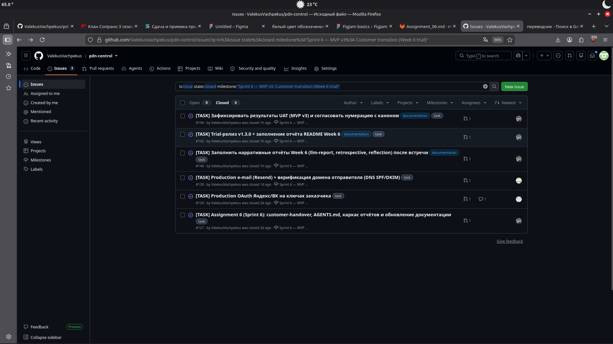
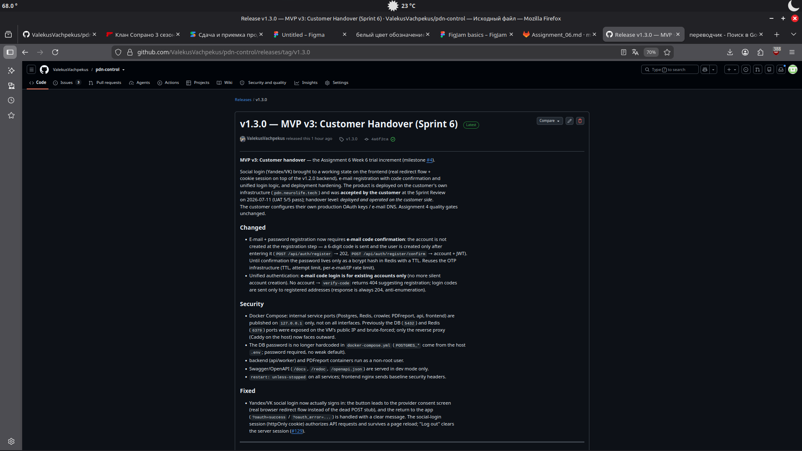
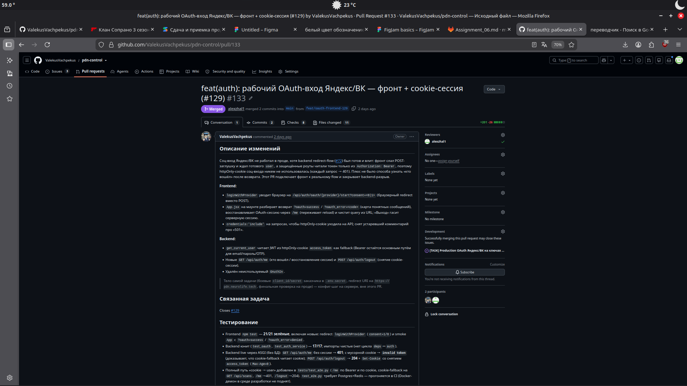
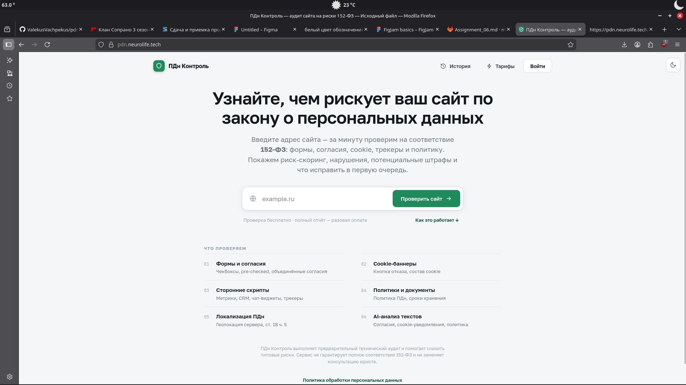
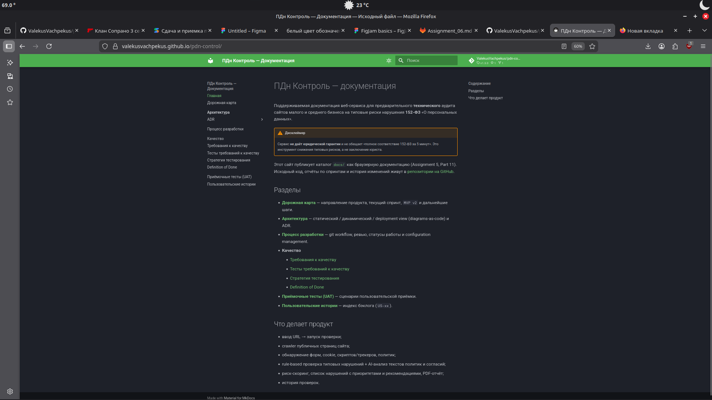

# Week 6 — Assignment 6 · Sprint 6 (публичный отчёт)

> Каноничный публичный отчёт за Week 6 (Sprint 6 в терминологии команды = «Sprint 4» в
> терминологии задания). Sprint dates: **2026-07-06 — 2026-07-12**.
>
> Встреча с заказчиком (Sprint Review + customer trial + подтверждение передачи) состоялась
> **2026-07-11**; продукт **принят**. Отчёт заполнен полностью.

## 1. Проект
**ПДн Контроль** — веб-сервис предварительного технического аудита сайтов на типовые
риски нарушения 152-ФЗ. См. [`README.md`](../../README.md).

## Бэклог и спринт
- **2. Product Backlog board:** GitHub Projects «доска команды» #1 (элементы с лейблами
  `user story` / `task`); публичный срез — [issues репозитория](https://github.com/ValekusVachpekus/pdn-control/issues),
  трассировка US — [`docs/user-stories.md`](../../docs/user-stories.md).
- **3. Sprint 6 Backlog board:** issues milestone #4 —
  https://github.com/ValekusVachpekus/pdn-control/milestone/4
- **4. Sprint 6 milestone:** https://github.com/ValekusVachpekus/pdn-control/milestone/4
- **5. Sprint Goal / dates / scope:** Выпустить стабильный trial/handover-candidate релиз
  (`v1.3.0`) на инфраструктуре заказчика — подключить production-OAuth (Яндекс/ВК) на его
  ключах и production-отправку e-mail через его DNS-записи — и провести ревью
  customer-facing документации на готовность к передаче. Даты: 2026-07-06 — 2026-07-12.
- **6. Sprint 6 size (SP):** **11 SP** — #127 (3) + #129 (5) + #130 (3); все три задачи
  закрыты. Отчётно-релизные задачи #140/#142 — без оценки.

## Trial-релиз
- **7. Сводка изменений Week 6 trial (`v1.3.0`):** соц-вход Яндекс/ВК доведён до рабочего
  состояния на фронте (реальный redirect-flow + cookie-сессия поверх бэкенда из v1.2.0,
  #129 / PR #133); регистрация по e-mail с подтверждением кодом и единая логика входа
  (PR #135); hardening развёртывания — внутренние порты только на `127.0.0.1`, пароль БД из
  окружения, non-root контейнеры (PR #137). Детали — [`CHANGELOG.md`](../../CHANGELOG.md)
  § `[1.3.0]`.
- **8. Product access artifact:** https://pdn.neurolife.tech
- **9. Access / run instructions:** [`README.md` § Локальный запуск](../../README.md#локальный-запуск),
  [`docs/customer-handover.md`](../../docs/customer-handover.md).

## Документация (customer-facing)
- **10. README:** [`README.md`](../../README.md)
- **11. CONTRIBUTING:** [`CONTRIBUTING.md`](../../CONTRIBUTING.md)
- **12. AGENTS:** [`AGENTS.md`](../../AGENTS.md)
- **13. Customer handover:** [`docs/customer-handover.md`](../../docs/customer-handover.md)
- **14. Hosted docs site:** https://valekusvachpekus.github.io/pdn-control/
- **15. Итог ревью документации заказчиком** (что ясно / неясно / чего не хватает): на
  встрече 11.07 заказчик прошёл по набору документации. **Ясно:** инструкции запуска в README
  (подтвердил, что сможет запустить сервис без команды), технические и юридические ограничения.
  **Не хватало явно:** ничего — заказчик подтвердил достаточность документации для передачи.
  Единственная ремарка — не сразу нашёл, где расположены доки (репозиторий / GitHub Pages /
  Swagger); устно сориентировали. Новых issue по документации не возникло.
- **19. Roadmap:** [`docs/roadmap.md`](../../docs/roadmap.md)
- **20. Обновлённая quality/testing/architecture/process документация:**
  [`docs/architecture/`](../../docs/architecture/),
  [`docs/quality-requirements.md`](../../docs/quality-requirements.md),
  [`docs/quality-requirement-tests.md`](../../docs/quality-requirement-tests.md),
  [`docs/testing.md`](../../docs/testing.md),
  [`docs/development-process.md`](../../docs/development-process.md).

## Передача и обратная связь
- **16. Transition-readiness summary** (что ещё должно произойти в Week 7): продукт **принят**
  и работает на инфраструктуре заказчика; уровень передачи — **`Deployed or operated on customer
  side`**, статус подтверждения — **`Accepted`**. На Week 7 остаётся: завершить начатую передачу
  GitHub-репозитория, опубликовать релиз `v1.3.0`, а заказчику — подставить свои production-ключи
  OAuth (он делает это сам). Новых фич заказчик не запросил. Подготовка встречи (агенда +
  trial/UAT-сценарий + чек-лист ревью доков): [`transition-meeting-agenda.md`](transition-meeting-agenda.md).
- **17. Таблица ответов на фидбек заказчика:**

  | Фидбек заказчика | Результат (PBI / issue) |
  |---|---|
  | Новых замечаний по продукту на встрече не поступило | Инкремент принят как есть («Accepted»), доработок не запрошено |
  | Production-ключи OAuth Яндекс/ВК | Заказчик подключает самостоятельно на своей стороне (#129, вынесено в передачу) |

- **18. Фидбек, ещё не закрытый:** блокирующего фидбека нет. Единственный оставшийся пункт —
  подстановка заказчиком собственных ключей OAuth (self-service, задокументировано в
  [`docs/customer-handover.md`](../../docs/customer-handover.md)).
- **21. UAT / customer-trial результаты:** заказчик выполнил сценарии вживую — **5/5 Pass**.
  Нумерация — по канону [`docs/user-acceptance-tests.md`](../../docs/user-acceptance-tests.md):

  | UAT | Сценарий | Итог | Ремарка заказчика |
  |---|---|---|---|
  | UAT-08 | Production-вход Яндекс/ВК | Pass | реализация устраивает; боевые ключи заказчик подставит сам |
  | UAT-09 | Письмо с кодом на e-mail | Pass | «письмо с кодом пришло» |
  | UAT-04 | PDF-отчёт vs веб-интерфейс | Pass | «данные совпадают» |
  | UAT-05 | Отказ на внутреннем адресе (anti-SSRF) | Pass | «корректное сообщение об ошибке» |
  | UAT-01 | Навигация и стабильность (скан → отчёт) | Pass | «всё хорошо, тесты прошли» |

## Релиз и Sprint Review
- **22. Week 6 SemVer trial release (`v1.3.0`):** тег `v1.3.0`,
  [страница релизов](https://github.com/ValekusVachpekus/pdn-control/releases) (публикуется на
  `main` после мёрджа отчётного PR).
- **23. CHANGELOG:** [`CHANGELOG.md`](../../CHANGELOG.md)
- **24. Sprint Review transcript/notes:** [`sprint-review-transcript.md`](sprint-review-transcript.md) *(или notes, если запись/приватный шеринг отклонены)*.
- **25. Sprint Review summary:** [`sprint-review-summary.md`](sprint-review-summary.md)
- **26. Reflection:** [`reflection.md`](reflection.md)
- **27. Retrospective:** [`retrospective.md`](retrospective.md)
- **28. LLM report:** [`llm-report.md`](llm-report.md)

## Итоги
- **29. Текущий статус продукта и ожидаемая работа Week 7:** MVP v3 (`v1.3.0`) развёрнут и
  **принят** на инфраструктуре заказчика (`pdn.neurolife.tech`); уровень передачи — «Deployed or
  operated on customer side». Заказчик новых спринтов/фич не запросил, поэтому Week 7 — это
  **завершение передачи, а не новый scope:** довести до конца перенос GitHub-репозитория,
  опубликовать релиз `v1.3.0`, зафиксировать в [`docs/customer-handover.md`](../../docs/customer-handover.md)
  подтверждённый уровень передачи и статус приёмки, подготовить Demo Day. Подстановку своих
  боевых ключей OAuth заказчик выполняет самостоятельно.
- **30. Contribution traceability:**

  | Участник | Роль | Issues | PR (автор) | Ревью | Вклад |
  |---|---|---|---|---|---|
  | Ilia Shchetkov (`ValekusVachpekus`) | Product Owner / Frontend | #127, #129 (фронт), #140, #142 | #128, #133, #141, #142 | #135, #137 | Фронт OAuth (redirect-flow + cookie-сессия), customer-handover, AGENTS, отчёты Week 6, roadmap, релиз |
  | Aleksandr Martiushev (`alexzhal1`) | Backend | #130 | #135, #137 | #128, #133 | Подтверждение e-mail при регистрации, единая логика входа, hardening портов/секретов/non-root; бэкенд OAuth (v1.2.0) |
  | Airat Mingazov (`azenlrd`) | Backend | #129 (assignee) | — | (запрошено на #141) | Владелец задачи production-OAuth (активация ключей заказчика); см. примечание ниже |
  | Ksenya Koroleva (`kskorqueen`) | Scrum Master | — | #139 | #141 | Sprint Review summary + transcript встречи |
  | Maksim Shakhrai (`ShakhraiMaksim`) | QA | — | — | — | Запись встречи, приёмочное тестирование на встрече |

  > Примечание по `azenlrd`: за Sprint 6 в репозитории нет смёрдженного PR его авторства —
  > код production-OAuth (бэкенд) относится к v1.2.0 (автор `alexzhal1`), фронт — PR #133
  > (автор `ValekusVachpekus`). За ним закреплена задача #129 (активация OAuth на ключах
  > заказчика). Если была работа вне репозитория — уточнить и дополнить.

- **31. Скриншоты** (`images/`):

  **Milestone Sprint 6 (#4) — Sprint Backlog и его закрытие:**

  

  **Week 6 SemVer trial release `v1.3.0`:**

  

  **Пример review-linked PR (issue-linked, с ревьюером и зелёным CI):**

  

  **Product access artifact — рабочий деплой на инфраструктуре заказчика:**

  

  **Hosted documentation site (GitHub Pages):**

  
